# Counter Strike: Global Offensive Event-Watch
_**Elevating Every Move**: Your Ultimate CS\:GO Tournament Tracker_

## Motivation
Counter Strike: Global Offensive (CS\:GO) has a massive following. The peak viewers for tournaments ranged from 1 million to 2.7 million in the past 5 years. In recent years, there are over 500 tournaments held per year, with combined prize pools ranging from 13 million to 18 million. (Esports Charts, 2023) Just last year, the game managed to be the 6th most watched game, with the majority of viewers watching through Twitch. Even though it is a decade old game, Counter Strike: Global Offensive still managed to attract a huge following the gaming boom during the COVID-19 pandemic. (Brooks, 2023)

With current popular tracking tools and sites, stats and match updates are usually limited to post map or series data as viewers have to tune in to live event streams to keep updated on the play by play of the match. Even while watching live event streams, observers of the game are limited to viewing one player at any time, resulting in actions happening off screen to be missed by the viewers. With this in mind, a live event watch would augment the viewing experience by allowing users to catch off screen plays in the form of text and visual updates.

GRID, which receives data straight from the game server, is the perfect data platform to build a CS\:GO tournament tracker, allowing viewers to keep themselves updated while watching the match or on the go.

## Pre-Series Analysis
This page is updated at the end of every series (`tournament-ended-series`) and before the start of the next (`tournament-started-series`), providing viewers with an overview of the match history and upcoming series.

The objectives of this page are:
- To present the teams playing in the upcoming series
- Predict the odds of each team winning
- Showcase historical winning statistics

This page is used to give viewers an overview of the upcoming series, allowing them to know what the next matches are according to the brackets. 

On this page, viewers will be able to identify the teams that will be playing in the upcoming series, view each team's match history with each player's Kill Death Assist Ratio (ADR), and view predictions on which team is more likely to win the upcoming series.

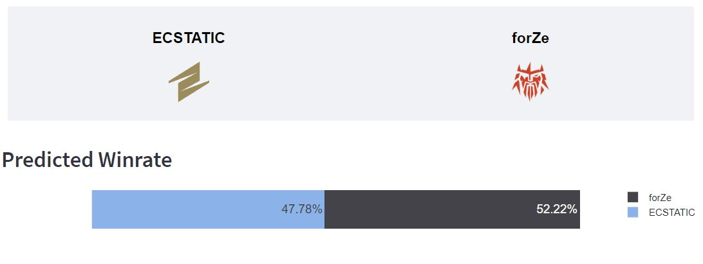
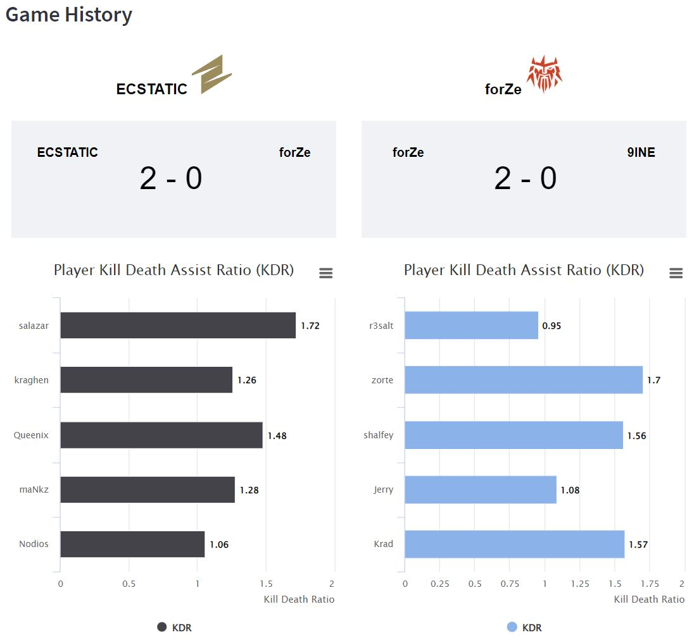

The approach to generating the predictions is explained in the following section.

### Series Win Prediction 
To help viewers predict the odds of each team winning the upcoming match, a deep learning model has been trained using Tensorflow based on information gathered from the previous series. 

Trying to predict the winning team is a complex problem, and there are many factors that can impact the odds of the team winning. This can include, but is not limited to:
- Individual Player performance (e.g. Player KDA statistics, years of experience)
- Team dynamics (e.g. how long has the current team roster been playing together)
- Coach experience and strategies
- Player condition on that day

Currently, only individual player performance is considered in the scope. Additional features can be used to augment the model at a later time.

The algorithm of the model is as follows:
1. First, the raw player statistics per round is extracted from all the preceding series and merged together into a single dataframe.
2. These statistics are then aggregated to game and round levels, split by side (`terrorists`/`counter-terrorist`), forming these 13 features:

    | Game Level | Round Level |
    | -------- | ------- |
    | `avg_kills_per_game`   `avg_deaths_per_game`   `avg_assists_per_game`   `avg_teamkills_per_game`   `avg_selfkills_per_game`   `avg_headshots_per_game`   `avg_bombs_defused_per_game`   `avg_bombs_planted_per_game`   `avg_bombs_exploded_per_game` | `avg_endinghealth_per_round`   `avg_endingarmor_per_round`    `avg_damageDealt_per_round`   `avg_damageTaken_per_round` |

    To avoid introducing look-ahead bias to the model, the features are computed on a rolling average basis.
    
    In other words, features for game 4 are computed by aggregating information seen from games 1-3; for game 5, information from games 1-4 were used, and so on.
4. To account for team dynamics and also factor in the opposing team, these features are then pivoted such that each row represents the information of all 10 players in the game. This results in there being a total of 130 features per game (13 features x 10 players). Player and team names are masked with aliases, with player_1 being the player with the highest `avg_kills_per_game` for that team
5. This dataset is then fed into a deep learning model using Tensorflow with 2 hidden layers. Dropout layers were also added to try to minimize overfitting of the model.

The trained model can be found in the `/model` folder, and a Jupyter notebook detailing this algorithm can be found in the `/notebooks` folder.

Before the start of every series, the aggregated player statistics dataset is updated with the latest information (`/model/agg_player_stats.csv`). For each of the players playing in the upcoming series, the player's statistics are then fetched and fed to the model. Finally, the likelihood of winning each game is then averaged to give an overall series win probability score.

## During Series Event Tracker
The tracker is designed with the vision to support live data feeds, updating the pre-round, during round and post round statistics whenever an update is received. 

The objectives of this page are:
- View match scores
- View weapons and equipment bought during buy time
- Display summary of kills, and game objectives (terrorists planting bombs, counter-terrorists diffusing bombs) in near real time
- Display visual feedback of each player's health and inventory state
- Show statistics (KDA, ADR, etc.) across rounds 

The following are event types that start and stop updating the each tab in this page:
| Tab | Event Type to Start Update | Event Type to Stop Update | Rationale |
| -------- | ------- | ------- | -------- |
| Pre-Round  | `game-started-round` | `round-ended-freezetime` | Buy time |
| During Round | `round-ended-freezetime` | `game-ended-round` | Actual gameplay - after buy time and before round ends |
| Post Round | `game-ended-round` | `game-started-round` | Post round, updated after round ended and before next round starts |

Regardless of which tab the user navigates to, the match scores of each team will be displayed at the top of the page.

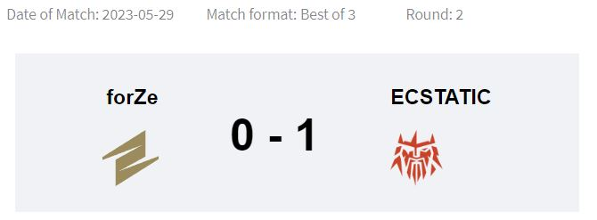

### Pre-Round
This tab updates when the event `game-started-round` is received, and stops updating when `round-ended-freezetime` is received. The page reflects the status of the round during the buy time where players gear up prior to the round starting, showing the economy of each player and their loadouts. With the buy of each team easily accessible, viewers will be able to have an idea of the kind of strategy a team will be employing for the upcoming round such as saving during an eco-round or force buying as an aggressive strategy to change the rhythm of the game.

The events tracked for this tab are `player-purchased-item`, `player-dropped-item` and `player-pickedUp-item`.

Each player is represented by a row in the inventory table, split by team. According to the event logs, the tables will auto-populate by showing the primary and secondary weapons, as well as the equipment bought by each player.

When the round is in progress, this page will indicate that the buy time is over.

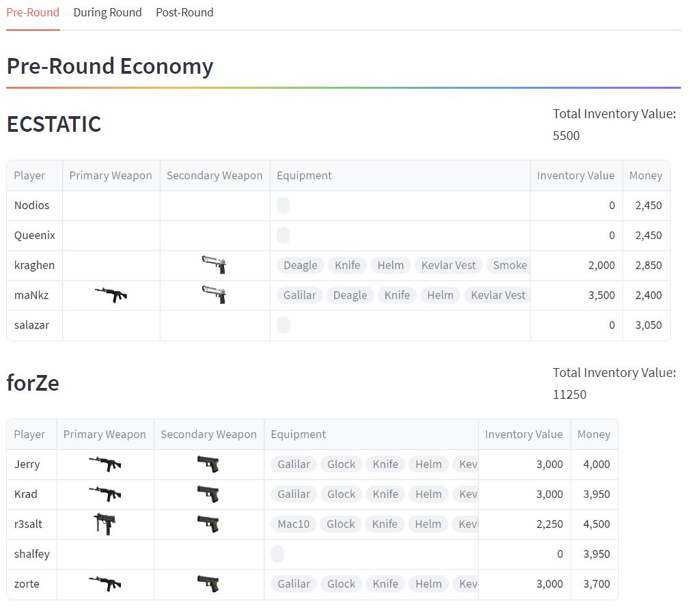

### During Round
This tab is the live event feed of the play by play during the round between the events `round-ended-freezetime` and `game-ended-round`. It features the players’ information including their loadouts, health, kill feed and objectives. This live event feed allows viewers to view information on demand as the round progresses, allowing live analysis or viewers who are unable to view the live event streams to keep up with the match all the same. When the round is not in progress, this page will indicate that the round has yet to start.

The following are the event types mapped to each feed:
| Kills | Objectives |
| -------- | ------- |
| `player-killed-player`   `player-teamkilled-player`   `player-selfkilled-player` | `player-completed-defuseBomb`   `player-completed-beginDefuseWithKit`    `player-completed-beginDefuseWithoutKit`   `player-completed-explodeBomb`   `player-completed-plantBomb` |

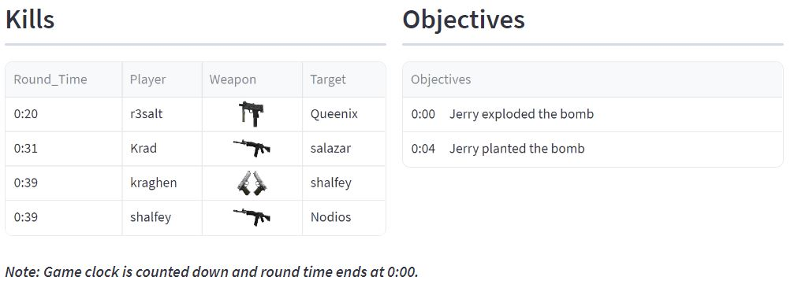

The events `player-damaged-player`, `player-selfdamaged-player` and `player-teamdamaged-player` are used to update players' health. Their total health consists of 2 bars - health (green) and armor (pink) - stacked to give viewers a quick glance of each player's status.

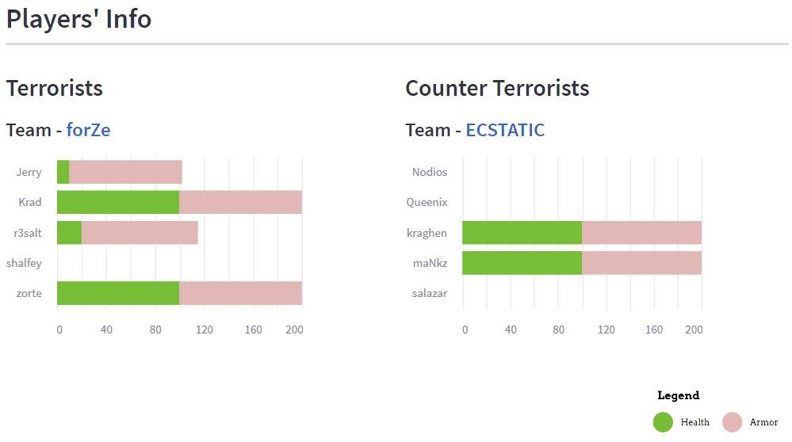

The events `player-dropped-item` and `player-pickedUp-item` are used to track inventory changes. 

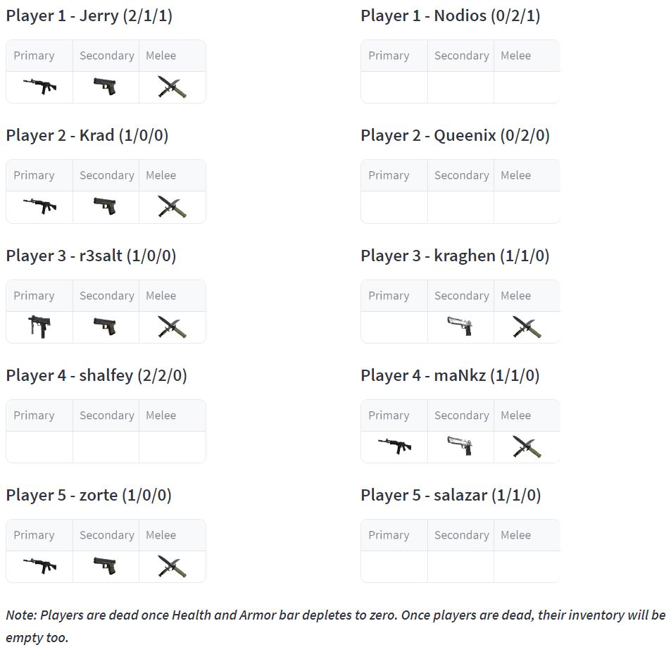

### Post Round
This tab updates when the event `game-ended-round` is received, and stops updating when `game-started-round` is received. We display a summarised view of all the rounds (cumulative) that have occurred up till the most recent round. Aside from providing basic information of the current status of the match (like map score), we display the team’s round performance which is the total number of kills of each team during the round. Next, we provide a tracker, displaying information around the individual player’s stats as well as their bomb plants and defuses.

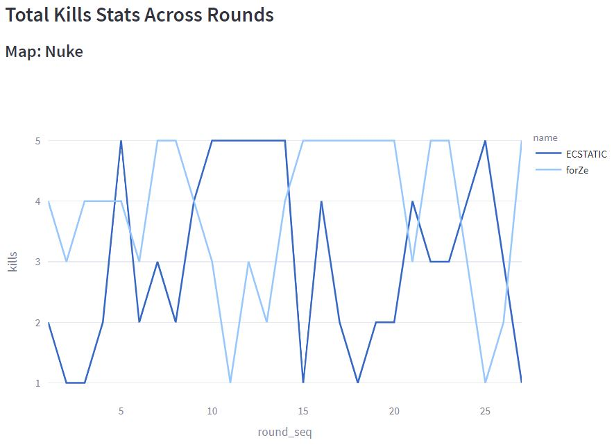

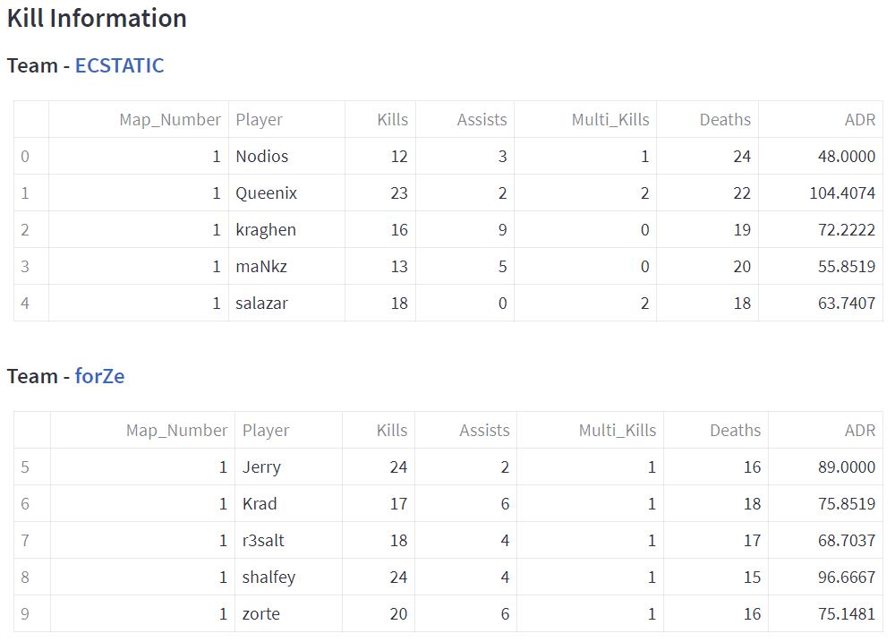

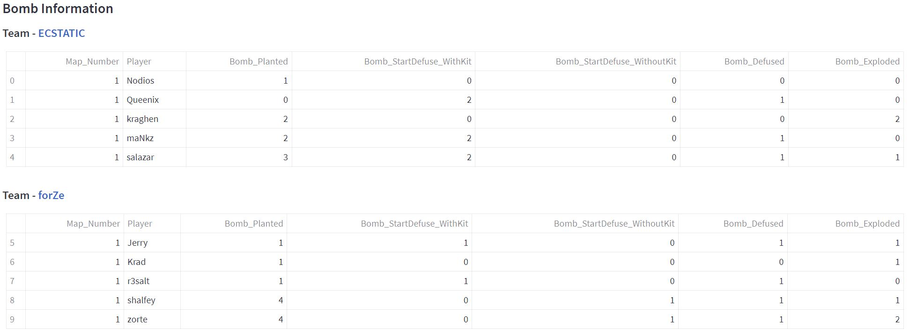

## Post Series Analysis
The objectives of this page are:
- View results of the series
- Display a brief summary of both the team performance and the individual player performance across the entire series
- Show insights around team performance in different economic situations
- View more detailed information of player performance across the different maps

The event types that start and stop updating this page are `series-ended-game` and `series-started-game` respectively.

Apart from displaying the series results, we also present the Series MVP, which is the player with the highest Average Damage Per Round (ADR) score, along with this player’s statistics like Kills Deaths Assists (KDA) information. In this page, we present both overview information and insights around the team and individual player’s performance across the full series. 

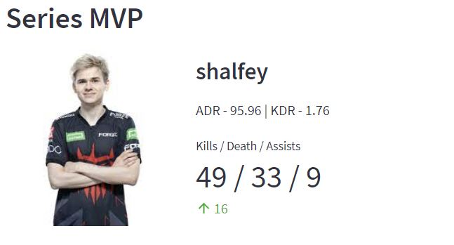

In the economy winrate section,  we provide further insights around how the team performs under different economic situations by classifying all rounds into the following economic situations:
- Eco Rounds
- Light Buy Rounds
- Half Buy Rounds
- Full Buy Rounds

After the rounds are classified, we calculate the win rate that the team has in each situation and compare them. By providing insights around the team’s win rate in different situations, we can identify areas of improvements for the teams.

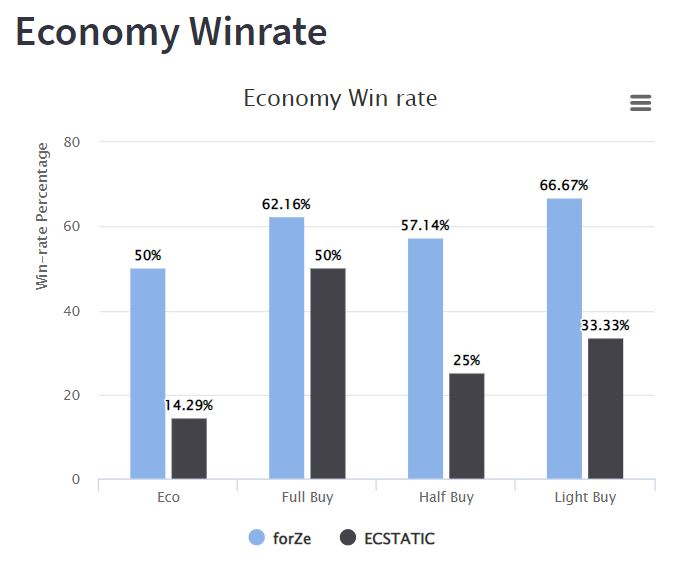

The following section displays comparisons between the two team’s individual players. The horizontal chart shows the direct difference in each player’s ADR score across the two teams. In the Series Multikills section, we want to highlight the “clutch” rate of each player and outstanding individual plays throughout the series. As such, we calculated the number of “multi-kills” for each player. A “multi-kill” is defined as when a player manages to kill 3 or more members from the opponent team. This can provide another point of view of a player's performance. For example, in the final series, although player “salazar” had the lowest ADR from both teams, he had the highest number of “multi-kills” situations.

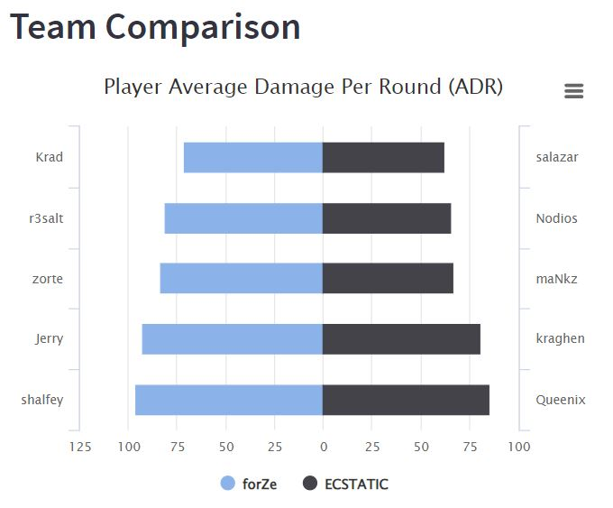

Lastly, we present some statistics around Player performance across each individual map, as well as the combined statistics for all maps. In this section, we display information like KDA, ADR and KDA Ratio. Users can choose to view the cumulative statistics across series, or by game (map).

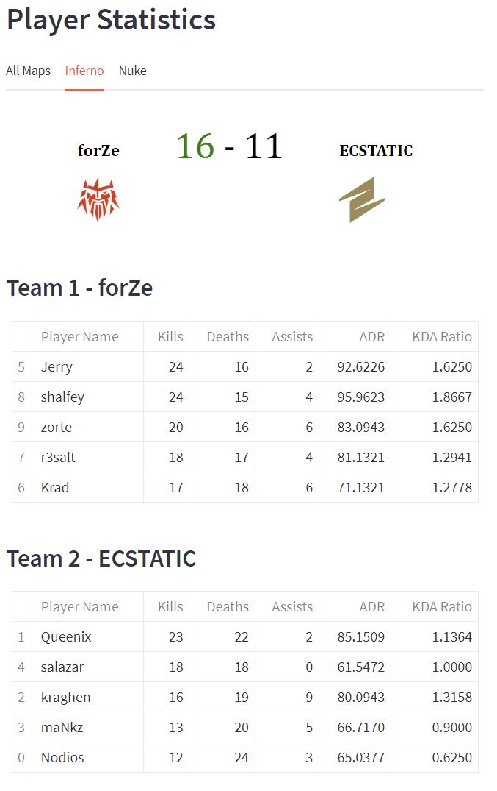

## Tools and Technologies Used
- Python 3.11.4
- Web app: Streamlit
- Charting: Altair, Highcharts, Plotly
- Data Transformation: NumPy, Pandas
- Machine Learning: TensorFlow, Keras

## Try It Out
GitHub Repo: https://github.com/TeoMinSi/csgo_tournament_tracker

### How to Run Locally

1. Create Python virtual environment (preferably with Anaconda)
2. Create a folder named `data` and extract the `CCT-Online-Finals-1` folder in the [`csgo.zip` file](https://github.com/grid-esports/datajam-2023/blob/master/data_files/csgo.zip) into it
3. In the repo root directory, run `pip install -r requirements.txt`, then run the web app with `streamlit run Home.py`

## References
Brooks, 2023. How CS\:GO Continues To Attract Players & Break Records: https://streamhatchet.com/blog/blog-how-csgo-continues-to-attract-players-break-records/ \
Esports Charts, 2023. CS\:GO - Esports Viewership and Statistics: https://escharts.com/games/csgo 
