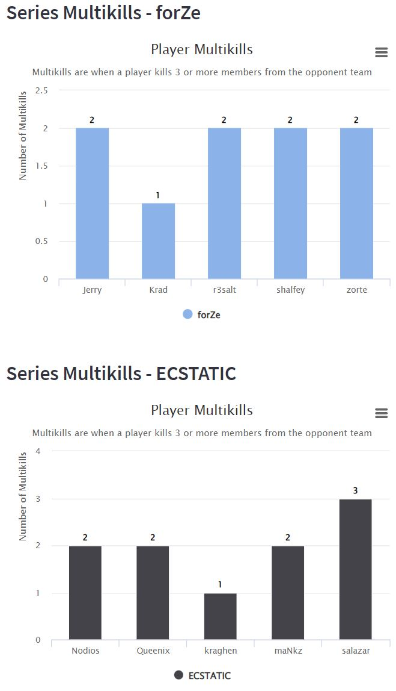

# CS:GO Event-Watch
Elevating Every Move: Your Ultimate CS:GO Tournament Tracker

## Motivation
Counter Strike: Global Offensive has a massive following. The peak viewers for tournaments ranged from 1 million to 2.7 million in the past 5 years. In recent years, there are over 500 tournaments held per year, with combined prize pools ranging from 13 million to 18 million. (Esports Charts, 2023) Just last year, the game managed to be the 6th most watched game, with the majority of viewers watching through Twitch. Even though it is a decade old game, Counter Strike: Global Offensive still managed to attract a huge following the gaming boom during the COVID-19 pandemic. (Brooks, 2023)

With current popular tracking tools and sites, stats and match updates are usually limited to post map or series data as viewers have to tune in to live event streams to keep updated on the play by play of the match. Even while watching live event streams, observers of the game are limited to viewing one player at any time, resulting in actions happening off screen to be missed by the viewers. With this in mind, a live event watch would augment the viewing experience by allowing users to catch off screen plays in the form of text and visual updates.

GRID, which receives data straight from the game server, is the perfect data platform to build a CS:GO tournament tracker, allowing viewers to keep themselves updated while watching the match or on the go.

## Pre-Series Analysis

## During Series Event Tracker

## Post Series Analysis

The objectives of this page are:
- View results of the series
- Display a brief summary of both the team performance and the individual player performance across the entire series
- Show insights around team performance in different economic situations
- View more detailed information of player performance across the different maps

| Event Type to Start Updating    | Event Type to Stop Updating |
| -------- | ------- |
| `series-ended-game` | `series-started-game` |

Apart from displaying the series results, we also present the Series MVP, which is the player with the highest Average Damage Per Round (ADR) score, along with this player’s statistics like Kills Deaths Assists (KDA) information. In this page, we present both overview information and insights around the team and individual player’s performance across the full series. 

In the economy winrate section,  we provide further insights around how the team performs under different economic situations by classifying all rounds into the following economic situations:
- Eco Rounds
- Light Buy Rounds
- Half Buy Rounds
- Full Buy Rounds

After the rounds are classified, we calculate the win rate that the team has in each situation and compare. By providing insights around the team’s win rate in different situations, we can identify areas of improvements for the teams.

The following section displays comparisons between the two team’s individual players. The horizontal chart shows the direct difference in each player’s ADR score across the two teams. In the Series Multikills section, we want to highlight the “clutch” rate of each player and outstanding individual plays throughout the series. As such, we calculated the number of “multi-kills” for each player. A “multi-kill” is defined as when a player manages to kill 3 or more members from the opponent team. This can provide another point of view of a player's performance. For example, in the final series, although player “salazar” had the lowest ADR from both teams, he had the highest number of “multi-kills” situations.

Lastly, we present some statistics around Player performance across each individual map, as well as the combined statistics for all maps. In this section, we display information like KDA, ADR and KDA Ratio.

## Tools and Technologies Used
- Python 3.11.4
- Web app: Streamlit
- Charting: Altair, Highcharts, Plotly
- Data Transformation: NumPy, Pandas
- Machine Learning: TensorFlow, Keras

## Try It Out
GitHub Repo: https://github.com/jfcheong/csgo_tournament_tracker

### How to Run Locally

1. Create Python virtual environment (preferably with Anaconda)
2. Create a folder named `data` and extract the `CCT-Online-Finals-1` folder in the [`csgo.zip` file](https://github.com/grid-esports/datajam-2023/blob/master/data_files/csgo.zip) into it
3. In the repo root directory, run `pip install -r requirements.txt`, then run the web app with `streamlit run Home.py`

## References
Brooks, 2023. How CS:GO Continues To Attract Players & Break Records: https://streamhatchet.com/blog/blog-how-csgo-continues-to-attract-players-break-records/ \
Esports Charts, 2023. CS:GO - Esports Viewership and Statistics: https://escharts.com/games/csgo 